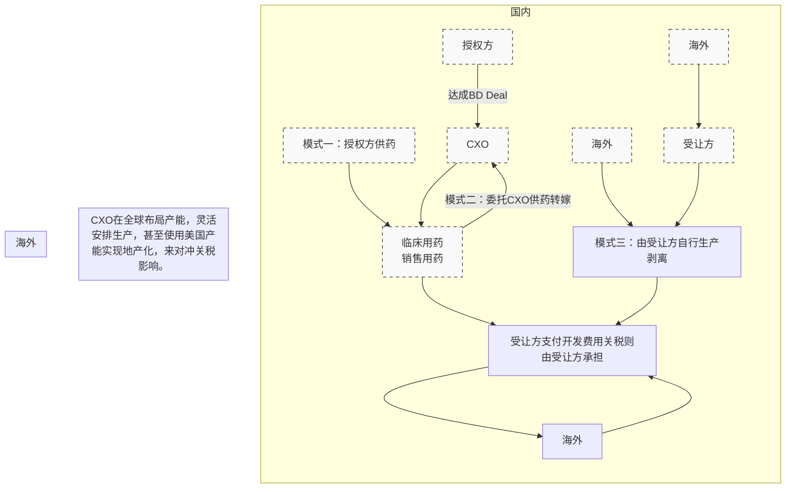
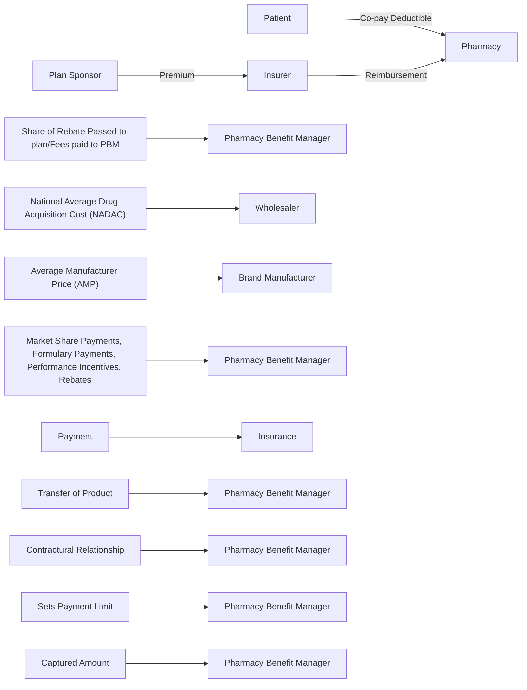

# 以 BD 出海关税风险小，看好创新药国际化进程

# 投资逻辑

美国潜在关税威胁对我国创新药影响小。原本全球药品贸易近乎零关税，据WTO官网显示，1994年《药品贸易协定》取消大量药品及其用于生产这些商品的物质的关税和其他关税和费用，将它们永久地约束在免税水平，加拿大、欧盟、日本、澳门（中国）、挪威、瑞士、英国和美国等之前已加入本协议。美东部时间2025年4月2日下午4时，美国总统特朗普签署行政令执行全面新对等关税政策(排除药品)，据美国政府于2025年4月14日发布的《Federal Register》显示，特朗普政府正在启动对药品和半导体进口的“232调查”，此举被广泛视为对处方药征收关税的前奏。关税虽未完全落地，但后续依旧存在不确定性。总体来说，在药品各细分领域中，我们预期关税波动对创新药赛道影响较小，持续看好A股、港股创新药企出海进程。

从中国视角，“直视”美潜在药品专项关税对我国创新药赛道影响，面对本轮美国的对药品加征专项关税的潜在威胁，受益于以下两大核心逻辑，我们认为对中国创新药企的潜在影响较小：

① 据我国海关数据显示，我国西成药（含创新药）出口敞口小，其中对美出口规模约11.6亿美元；于此同时我国西药制剂出口市场多元化程度高，其中对美西药制剂出口规模仅占我国全部西药制剂出口的16.55%。因此，若相关政策落地、预计对我国创新药赛道潜在影响有限。  
② 中国创新药多数采用 BD（Business Development，商务合作，即将药物的海外开发权益授权给国外药企）方式出海，其本质是 IP（Intellectual Property）的交易、并不涉及具体药品的制造出口。从 BD 达成阶段来看，其 BD 模式的本质是国内外药企的利益共享；同时根据《服务贸易总协定》（GATS）规定相关收入（首付款+里程碑付款）被纳入经常账户的服务贸易收入，与美国目前关注的货物贸易逆差无关。从 BD 执行阶段，我们详细的拆解了在国内创新药企与海外跨国药企达成 BD 协议中、可能出现的药品制造安排，不管是临床用药（相对小规模生产）还是后期商业化用药（相对大规模生产），我们认为国内创新药企均能够 BD 执行阶段实现对潜在关税的免疫。

从美国视角，“侧看”潜在药品专项关税对我国创新药赛道影响。4月8日特朗普提及的潜在关税将是对药品的专项关税，专项关税的针对性相较于前一轮“对等关税”更强，因此对药品专项关税的博弈对象和博弈目标分析是关键。

① 美欧成品药贸易逆差预计成美国关注焦点。美国潜在的药品专项关税的首要博弈对象将是欧盟，因此也从侧面反应该专项关税预计对我国的影响有限。据美国普查局（US. Census）统计数据显示，2024年，美国医药和药品进口额达到2340亿美元。对美国出口量排名靠前的有爱尔兰（约660亿美元，占进口总额的 $28.1\%$ ），其次是瑞士（约190亿美元，占 $8.2\%$ ）和德国（约170亿美元，占 $7.4\%$ ）等欧洲国家。

② 特朗普威胁加征的潜在药品专项关税的最终目的主要有两个：①迫使药企将产能迁至美国；②平抑美国国内较高的药价水平。但我们认为，通过潜在药品专项关税实现以上两个博弈目标的难度大，因此，这也在一定程度上，会影响未来该潜在关税的落地与实施。

# 投资建议

基于上述分析，我们坚定看好我国创新药企能够穿越本轮关税周期。建议投资者重点关注前期已经以 BD 方式出海的药企标的（详见报告图 8/9），或体内有成熟技术平台、未来能够持续产出创新管线并具备 BD 潜质的创新药企，如恒瑞医药、科伦博泰、康方生物、翰森制药、信达生物、诺诚健华等。

# 风险提示

关税导致创新药开发成本上升；关税导致创新药企成本增加进而挤压研发开支；关税导致中美关系紧张进而阻碍两国创新药企专利合作。

# 内容目录

美国潜在药品专项关税对我国创新药影响小，坚定看好创新药企穿越关税周期....3

从中国视角，创新药对美贸易量小，以BD出海较少受潜在关税影响....3

逻辑一：我国西成药进口大于出口、贸易风险小，多元化程度高，潜在冲击低....3

逻辑二：以BD出海帮助创新药企较少受到潜在关税影响....5

从美国视角，潜在关税博弈对象为欧洲，博弈目标实现难度大.... 10

逻辑一：博弈对象，美欧成品药贸易逆差预计成美国关注焦点.... 10

逻辑二：博弈目标，平抑药价和迁回产能实现难度大.... 11

投资建议....14

风险提示....14

# 图表目录

图表 1：2024 年中国医药保健品中西成药外贸风险敞口小.... 4

图表2：2024年我国医药产品中西成药出口美国占比小.... 4

图表3：2024年我国西药制剂出口市场多元化程度高....5

图表4：中国创新药出海迎来密集窗口期....5

图表5：中国创新药出海方式可归集为三类....6

图表6：中国生物药BD（license-out）数量和金额节节攀升....6

图表7：从协议制造端的分析发现，关税对BD协议中授权方（国内创新药企）影响将非常小....7

图表8：2023年至今（2025年4月11日）中国创新药企对外BD合作梳理（一）....8

图表9：2023年至今（2025年4月11日）中国创新药企对外BD合作梳理（二）....9

图表 10：2025 年 4 月 14 日特朗普政府启动对药品进口 232 调查，本轮调查的核心关注点包括十条……10

图表 11： 爱尔兰等欧洲国家是美国药品进口主要来源地.... 10

图表 12：医药产品是欧盟对美出口第一大贸易品类.... 10

图表 13：2023 年全美医疗保健支出占 GDP 比重维持在 17.6%……12

图表 14：在美销售的仿制药生产企业数量多，议价能力差，利润空间低....12

图表 15：在美销售的创新药生产企业为独家，议价能力强……13

图表 16: 美国短缺的仿制药品种数量维持在较高水平.... 13

图表 17：美国生物制药生产设施数量总体维持稳定状态....14

图表 18：部分 MNC 宣布在美投资产能.... 14

# 美国潜在药品专项关税对我国创新药影响小，坚定看好创新药企穿越关税周期

原本全球药品贸易近乎为零关税。据WTO官网显示，1994年《药品贸易协定》（也称为《药品协定》或《药品协定》）取消了大量药品及其用于生产这些商品的物质的关税和其他关税和费用，将它们永久地约束在免税水平。该协议是在乌拉圭回合贸易谈判期间达成的，由一组参与者签署并仅适用于一组参与者，这些参与者也承诺在最惠国利益的基础上实施成果。加拿大、欧盟、日本、澳门（中国）、挪威、瑞士、英国和美国之前已加入本协议。

4月2日，美国首轮“对等关税”并不包含药品。据美国白宫官网显示，美国东部时间2025年4月2日下午4时，美国总统特朗普签署行政令执行全面新对等关税政策(排除药品)，从2025年4月5日起对所有进口美国商品征收至少10%的关税，并从2025年4月9日起对一些被视为贸易“违规严重国”征收更高的个性化关税。

4月8日，特朗普威胁对药品加征潜在关税。新华社在2025年4月10日报道，特朗普当地时间2025年4月8日发表讲话称，美国将对药品征收关税。特朗普认为，一旦对药品征收关税，制药公司将在美国开设工厂，因为美国是“最大的市场”。

4月14日，据美国政府于当日发布的《Federal Register》显示，特朗普政府正在启动对药品和半导体进口的“232调查”，此举被广泛视为对处方药征收关税的前奏。

面对美国加征潜在药品专项关税所带来的不确定性,本报告从中国和美国两个视角分析对我国创新药企可能的影响:其中从中国视角提出两大核心逻辑:创新药出口量小+主要以BD方式出海;另外还从美国视角分析出专项关税预计的博弈对象主要是欧洲国家、同时较难实现“平抑药价+制药业回流”博弈目标。基于以上两大视角,我们最终得出结论:特朗普威胁发动的潜在第二轮“药品专项关税”预计对我国创新药影响小,因此,坚定看好我国创新药企穿越关税周期。

# 从中国视角，创新药对美贸易量小，以 BD 出海较少受潜在关税影响

不同于市场的观点，我们认为：

① 面对本轮美国的对药品加征关税的潜在威胁，中国创新药赛道外贸敞口小，若相关政策落地、预计对我国创新药赛道潜在影响有限。

② 中国创新药多数采用 BD（Business Development，商务合作，即将药物的海外开发权益授权给国外药企）方式出海，其本质是 IP（Intellectual Property）的交易、并不涉及具体药品的制造出口。BD 一方面可帮助国内药企降低海外开发、销售创新药所面临的风险；另一方面 BD 也可以绕过东道国的关税和非关税壁垒，并借助当地药企的开发和渠道优势实现药物的快速上市、销售。在此期间，国内创新药企也可以从后续的协议规定里程碑付款及销售分成享受创新药海外收益。

基于两大核心逻辑，从中国视角，我们坚定看好我国创新药标的能够穿越本轮关税周期。

# 逻辑一：我国西成药进口大于出口、贸易风险小，多元化程度高，潜在冲击低

我国西成药（包含创新药）呈现逆差状态、且规模大。根据中国海关统计数据显示，2024年我国医药保健品合计实现165.5亿美元的顺差，其中中药类、西药类和医疗器械类贡献顺差分别为21.5亿美元、14.6亿美元、129.5亿美元。进一步细拆我国西药类的对外贸易结构，其中西药原料药实现对外顺差321.8亿美元，西成药（西药制剂）实现逆差158.8亿美元，生化药实现逆差148.4亿美元。因此我国医药保健品中的西药原料药及医疗器械是主要顺差来源，而西成药和生化药则主要呈现逆差态势。

西成药进一步可以按照仿制药和创新药的维度进行拆分。2024年我国西成药全球出口额约为69.5亿美元、而进口额约为228.3亿美元。因此我国西成药整体对外贸易敞口小、而归集到我国创新药的外贸敞口将更小，因此我们预计后续我国创新药赛道受美国关税政策潜在波动所带来的影响较小。

<table><tr><td colspan="8">2024年中国医药保健品进出口分类统计</td></tr><tr><td>名称</td><td>进出口总额(亿美元)</td><td>进出口净额(亿美元)</td><td>出口额(亿美元)</td><td>进口额(亿美元)</td><td>进出口同比(%)</td><td>出口同比(%)</td><td>进口同比(%)</td></tr><tr><td>医药保健品合计</td><td>1993.8</td><td>165.5</td><td>1079.7</td><td>914.1</td><td>2.1</td><td>5.9</td><td>-2.0</td></tr><tr><td>一、中药类</td><td>83.7</td><td>21.5</td><td>52.6</td><td>31.1</td><td>0.4</td><td>-3.3</td><td>7.4</td></tr><tr><td>1.1提取类</td><td>37.4</td><td>22.8</td><td>30.1</td><td>7.3</td><td>-5.3</td><td>-7.7</td><td>6.5</td></tr><tr><td>1.2中成药</td><td>8.6</td><td>-0.7</td><td>4.0</td><td>4.7</td><td>12.9</td><td>16.9</td><td>9.7</td></tr><tr><td>1.3中药材及饮片</td><td>18.4</td><td>5.5</td><td>12.0</td><td>6.5</td><td>-5.0</td><td>-9.1</td><td>3.8</td></tr><tr><td>1.4保健品</td><td>19.3</td><td>-6.2</td><td>6.6</td><td>12.7</td><td>13.4</td><td>21.0</td><td>9.9</td></tr><tr><td>二、西药类</td><td>1064.5</td><td>14.6</td><td>539.6</td><td>525.0</td><td>2.5</td><td>5.7</td><td>-0.6</td></tr><tr><td>2.1西药原料药</td><td>538.1</td><td>321.8</td><td>429.9</td><td>108.2</td><td>5.6</td><td>5.1</td><td>7.9</td></tr><tr><td>2.2西成药</td><td>297.8</td><td>-158.8</td><td>69.5</td><td>228.3</td><td>-3.5</td><td>10.0</td><td>-7.0</td></tr><tr><td>2.3生化药</td><td>228.7</td><td>-148.4</td><td>40.2</td><td>188.5</td><td>3.5</td><td>4.6</td><td>3.3</td></tr><tr><td>三、医疗器械类</td><td>845.5</td><td>129.5</td><td>487.5</td><td>358.0</td><td>1.9</td><td>7.3</td><td>-4.7</td></tr><tr><td>3.1医用敷料</td><td>45.4</td><td>35.1</td><td>40.3</td><td>5.2</td><td>0.3</td><td>0.8</td><td>-3.2</td></tr><tr><td>3.2一次性耗材</td><td>145.2</td><td>65.1</td><td>105.2</td><td>40.0</td><td>9.5</td><td>13.9</td><td>-0.7</td></tr><tr><td>3.3医药诊断与治疗</td><td>503.0</td><td>-57.9</td><td>222.6</td><td>280.4</td><td>-0.8</td><td>6.9</td><td>-6.1</td></tr><tr><td>3.4保健康复用品</td><td>116.4</td><td>80.1</td><td>98.3</td><td>18.1</td><td>4.6</td><td>4.3</td><td>6.2</td></tr><tr><td>3.5口腔设备与材料</td><td>35.5</td><td>7.0</td><td>21.3</td><td>14.3</td><td>5.1</td><td>9.1</td><td>-0.3</td></tr></table>

来源：中国医药保健品进出口商会，中国海关  
注：进出口净额=出口额-进口额；生化药：是指从动物器官、组织、体液、分泌物

中经前处理、提取、分离、纯化等制得的安全、有效、质量可控的药品，主要包括蛋白质、多肽、氨基酸及其衍生物、多糖、核苷酸及其衍生物、脂、酶及辅酶等。

按照地域拆分，虽然美国是我国医药产品出口第一大目的地、但西成药出口占比低。据中国海关数据显示，2024年我国对美出口医药产品价值190.5亿美元，其中中药类、西药类、医疗器械分别达8.7亿美元、64.3亿美元、117.6亿美元。进一步详细拆分对美出口的西药类产品，其中仅有 $18\%$ 的药品为西成药（约11.6亿美元），最终归集到创新药对美出口敞口将更小。

图表2：2024年我国医药产品中西成药出口美国占比小  

pie

| 目的市场 | 出口额 (亿美元) | 同比 (%) | 占比 (%) |
| :--- | :--- | :--- | :--- |
| 美国 | 190.5 | 11.7 | 17.6 |
| 印度 | 83.5 | 1.2 | 7.7 |
| 日本 | 54.7 | -4.6 | 5.1 |
| 德国 | 48.0 | 4.4 | 4.5 |
| 韩国 | 40.2 | 5.1 | 3.7 |
| 荷兰 | 37.1 | 12.5 | 3.4 |
| 巴西 | 34.6 | 12.6 | 3.2 |
| 俄罗斯 | 33.6 | 5.3 | 3.1 |
| 越南 | 24.4 | 4.5 | 2.3 |
| 中国香港 | 22.4 | -30.9 | 2.1 |

| 品类 | 进出口总额::金额 (亿美元) | 进出口总额::同比 (%) | 进出口净额::金额 (亿美元) | 进出口净额::金额 (亿美元) | 出口::金额 (亿美元) | 出口::金额 (亿美元) | 进口::金额 (亿美元) | 进口::金额 (亿美元) |
| :--- | :--- | :--- | :--- | :--- | :--- | :--- | :--- | :--- |
| 合计 | 341.1 | 3.9 | 39.9 | — | 190.5 | 11.8 | 150.6 | -4.6 |
| 中药类 | 10.7 | 25.1 | 6.7 | — | 8.7 | 32.7 | 2.0 | 0.4 |
| 西药类 | 127.6 | 6.7 | 0.9 | — | 64.3 | 13.8 | 63.3 | 0.4 |
| 医疗器械 | 202.8 | 1.3 | 32.3 | — | 117.6 | 9.4 | 85.2 | 8.1 |

| 类别 (饼图) | 占比 (%) |
| :--- | :--- |
| 生化药 | 12% |
| 西药制剂 | 18% |
| 原料药 | 70% |

来源：中国医药保健品进出口商会，中国海关，中国医药创新促进会  
注：进出口净额=出口额-进口额

我国西药制剂除了整体外贸敞口小、且为逆差之外，我国西药制剂对外贸易的地域结构多元化程度高。据中国海关数据显示，2024年我国西药制剂出口到美国的占比仅为16.55%，第二顺位的是向丹麦出口、占比约为14.17%。总体来说，我国西成药的对外多元化程度高，在一定程度上也将很大程度稀释美国潜在的关税影响。

图表3：2024年我国西药制剂出口市场多元化程度高  

treemap

| Category | Value (%) |
| --- | --- |
| 其他 | 35.10 |
| 美国 | 16.55 |
| 丹麦 | 14.17 |
| 法国 | 4.73 |
| 澳大利亚 | 3.73 |
| 印度 | 4.29 |
| 韩国 | 3.38 |
| 菲律宾 | 2.53 |
| 巴西 | 2.21 |
| 尼日利亚 | 2.17 |
| 英国 | 2.02 |
| 德国 | 1.95 |
| 比利时 | 1.69 |
| 中国香港 | 1.98 |
| 日本 | 1.83 |
| 西班牙 | 1.66 |

来源：中国医药保健品进出口商会，中国海关

# 逻辑二：以 BD 出海帮助创新药企较少受到潜在关税影响

我国创新药多以BD方式出海。我国创新药发展迅速，但从中国海关贸易数据来看，西成药对外出口的量少、风险敞口小的底层逻辑在于：与海外成熟（或已上市）的创新药及其体系相比，我国创新药目前发展正处于成长爆发期、新分子开发不断涌现，为了尽早兑现创新分子价值、分担研发的成本风险，国内创新药企更多选择BD方式将分子海外权益授出，而BD本质是IP的交易而非制造端“有形产品”的转移。

复盘中国创新药出海，BD逐渐成为目前主流方式。2015年中国加入ICH（人用药品注册技术要求国际协调会，International Council for Harmonisation of Technical Requirements for Pharmaceuticals for Human Use），标志着中国创新药开发标准与国际接轨，为我国创新药出海奠定制度规范基础。2019年和2022年，百济神州的泽布替尼（BTK-TKI）和传奇生物的Carwkti(BCMA CAR-T)分别获FDA批准上市，成为中国创新药出海的重要里程碑事件。

图表4：中国创新药出海迎来密集窗口期  

```mermaid
graph LR
  Start["1992"] --> A["原料药出海起点：海正药业妥布霉素获首个FDA证书"]
  A --> B["仿制药出海起点：华海药业的奈韦拉平成首个通过FDA认证的中国制剂"]
  B --> C["创新药出海起点：微芯生物将西达本胺BD给沪亚生物"]
  C --> D["创新药出海启航：中国入ICH，国内医药研发接轨国际"]
  D --> E["华海药业的帕罗西汀胶囊是中国首个在美专利挑战成功的首仿药"]
  E --> F["ICHE17指导原则落地，中国药企可实现全球同步研发与注册"]
  F --> G["百济神州的泽布替尼是中国首个获得FDA突破性疗法认定、首个在美国获批的创新药。"]
  G --> H["传奇生物的CAR-T产品Carvykti获FDA批准上市，成为首款成功出海的CAR-T产品"]
  H --> I["当年累计License-out交易数量反超License-in，被誉为中国创新药出海“元年”"]
  I --> J["君实生物的特瑞普利单抗成为国内首个获美国FDA批准上市PD-1抑制剂"]
  J --> K["中国创新药license-out事件数量持续攀升达45起"]
```

flowchart

复盘我国创新药出海方式，主要可归集为三类：“自主出海”、“合作出海”、“借船出海”。其中自主及合作出海虽然长期收益大，但壁垒高、风险和成本大，而基于我国目前创新药企所处的发展阶段，借船出海自然成为了目前最适合中国创新药出海的方式之一。

图表5：中国创新药出海方式可归集为三类

<table><tr><td>出海模式</td><td>自主出海</td><td>合作出海</td><td>借船出海</td></tr><tr><td>核心逻辑</td><td>自主权</td><td>出让部分自主权</td><td>利益共享</td></tr><tr><td>商业模式</td><td>独立进行国际临床研究和推动药品上市,并在药品上市之后,独立建立商业化团队销售</td><td>中国药企能广泛筛选海外企业,寻找那些在海外商业化能力强且能助其在海外临床积累经验的合作伙伴</td><td>将药品海外开发、商业化权益授权给跨国药企,由他们推动药品的后续研发与销售,为此公司将收取一笔首付款和潜在里程碑付款以及销售分成</td></tr><tr><td>相对收益</td><td>独享海外市场的商业化收益</td><td>分担药品开发不确定性风险及昂贵成本,并借助合作伙伴当地经验加速产品临床、注册和销售</td><td>授权国际临床与商业化投入门槛较低,适合资源有限且国际化经验尚浅的药企,同时选择此模式可快速获得资金,缓解资金压力</td></tr><tr><td>潜在成本</td><td>该模式对药企的资源投入、国际化能力及风险承受能力要求较高</td><td>中国药企难以直接掌控海外市场销售策略及结果,商业化收益也可能受到合作伙伴的制约</td><td>企业将难以在海外市场研发及商业化过程中占据主导地位</td></tr><tr><td>典型案例</td><td>百济神州泽布替尼2019年获FDA批准上市,且24年全球销售超20亿美元</td><td>君实生物2021年与Coherus达成协议共同开发特瑞普利单抗在美国/加拿大市场,另外君实还和一众海外药企达成全球市场开发协议</td><td>2025年,恒瑞医药将Lp(a)口服小分子抑制剂HRS-5346许可给默沙东,获得了2亿美元首付款和最高17.7亿美元的里程碑付款</td></tr></table>

来源：沙利文，各公司官网，卫健委官网，医药魔方，

BD 达成阶段看潜在关税影响：基于下述两大核心逻辑，我们认为，中国创新药企以 BD 方式出海，将很大程度上避免潜在关税扰动。

BD 实现了利益共享：以 BD 为代表的借船出海与自主出海模式相比，最大的区别在于前者是将国内创新药企与海外 MNC（大型跨国药企）进行利益共享（共享分子价值）、而后者则是在东道国与 MNC 进行市场份额的竞争。利益共享的模式会使得国内创新药企与海外创新药企共荣共损，且大型 MNC 在东道国有广泛的利益和资源网络、甚至其能通过游说组织对当地政府政策施加较大影响。  
BD 贸易算服务收入：根据《服务贸易总协定》(GATS)规定，服务贸易包括跨境交付、境外消费、商业存在和自然人流动四种形式。其中药品 BD 交易通常涉及技术授权（License-out/in）、专利许可、研发合作等，这些活动属于知识产权服务（IP）或专业服务，而非实物商品的买卖。例如，中国药企将某款 ADC（抗体偶联药物）的全球权益授权给跨国药企（MNC），国内药企收取首付款和里程碑款项，这类交易属于特许权使用费或技术转让收入，归类为服务贸易（涉及无形资产的交换，如专利、临床数据等）。本轮美国特朗普政府加征关税的出发点在于平衡贸易逆差、促使制造业回流。而美国在服务贸易中积累了较大的贸易顺差，同时药品 BD 并不涉及制造环节、仅仅是 IP 的交易，与美国政府宣传的“制造回流”无关。

图表6：中国生物药BD（license-out）数量和金额节节攀升  

bar_line

| Year | license-out交易首付款 (亿美元) | license-in交易首付款 (亿美元) | license-out交易事件数 (%) | license-in交易事件数 (%) |
| --- | --- | --- | --- | --- |
| 17A | ~10 | ~3 | ~2 | ~15 |
| 18A | ~1 | ~0 | ~3 | ~26 |
| 19A | ~7 | ~0 | ~5 | ~26 |
| 20A | ~15 | ~0 | ~14 | ~28 |
| 21A | ~40 | ~3 | ~14 | ~30 |
| 22A | ~190 | ~9 | ~20 | ~28 |
| 23A | ~270 | ~18 | ~33 | ~9 |
| 24A | ~240 | ~13 | ~45 | ~13 |

来源：Insights

BD 执行阶段看潜在关税影响：根据下图，我们详细的拆解了在国内创新药企与海外跨国

图表7：从协议制造端的分析发现，关税对BD协议中授权方（国内创新药企）影响将非常小  

flowchart

来源

图表8：2023年至今（2025年4月11日）中国创新药企对外BD合作梳理（一）

<table><tr><td>交易时间</td><td>转让方</td><td>受让方</td><td>项目名称</td><td>机制</td><td>当前开发状态</td><td>交易金额</td></tr><tr><td>2025-04-07</td><td>恒瑞医药</td><td>Merck</td><td>SHR7280</td><td>GNRHR化药</td><td>临床III期</td><td>首付款:15百万欧元(16.37百万美元),特许权使用费:实际年净销售额两位数的销售提成</td></tr><tr><td>2025-03-25</td><td>恒瑞医药</td><td>MSD</td><td>HRS-5346</td><td>Lp(a)化药</td><td>临床II期</td><td>里程碑付款:1770百万美元,首付款:200百万美元,特许权使用费:若HRS-5346获批可获得基于净销售额的特许权使用费</td></tr><tr><td>2025-03-24</td><td>联邦制药</td><td>Novo Nordisk</td><td>UBT251</td><td>GLP1R,GIPR,GCGR多肽</td><td>临床II期</td><td>里程碑付款:1800百万美元,首付款:200百万美元</td></tr><tr><td>2025-03-21</td><td>和铂医药</td><td>AZ</td><td>Harbour Mice®全人源抗体技术平台+两项临床前免疫分子</td><td>多抗</td><td></td><td>首付款:175百万美元,里程碑付款:4400百万美元,特许权使用费:基于未来产品净销售额</td></tr><tr><td>2025-02-19</td><td>石药集团</td><td>Radiance Biopharma</td><td>SYS 6005</td><td>ROR1 ADC</td><td>临床I期</td><td>里程碑付款:1225百万美元,首付款:15百万美元,特许权使用费:根据该产品于该地区的年度销售净额计算的分层销售提成</td></tr><tr><td>2025-02-18</td><td>贝海生物</td><td>Zydus Pharmaceuticals</td><td>BEIZRAY</td><td>TUB化药</td><td>批准上市</td><td>里程碑付款:10百万美元,首付款:15百万美元</td></tr><tr><td>2025-02-10</td><td>百奥泰</td><td>Intas Pharmaceutical</td><td>BAT2506</td><td>TNF-α单抗</td><td>申请上市</td><td>里程碑付款:143.5百万美元,交易总额:164.5百万美元,首付款:21百万美元</td></tr><tr><td>2025-02-06</td><td>复宏汉霖</td><td>Dr.Reddy&#x27;s Laboratories</td><td>HLX15</td><td>CD38单抗</td><td>临床III期</td><td>交易总额:131.6百万美元,首付款:33百万美元,里程碑付款:98.6百万美元,特许权使用费:按年度净销售额的约定比例区间(不高于8%)向复宏汉霖支付特许权使用费</td></tr><tr><td>2025-01-24</td><td>启光德健</td><td>AIMEDBIO,Biohaven</td><td>GQ1011+创新生物偶联核心平台技术</td><td>FGFR3 ADC</td><td>临床前</td><td>交易总额:13000百万美元</td></tr><tr><td>2025-01-22</td><td>乐普生物</td><td>AriVent Biopharma</td><td>MRG007</td><td>CDH17 ADC</td><td>临床前</td><td>里程碑付款:1160百万美元,首付款:47百万美元,特许权使用费:基于大中华区以外地区净销售额的分级特许权使用费</td></tr><tr><td>2025-01-20</td><td>诺诚健华</td><td>Prolium Bioscience</td><td>ICP-B02</td><td>CD3*CD20双抗</td><td>临床I/II期</td><td>首付款:17.5百万美元,里程碑付款:502.5百万美元,交易总额:520百万美元</td></tr><tr><td>2025-01-20</td><td>君实生物</td><td>LEO Pharma A/S</td><td>特瑞普利</td><td>PD-1单抗</td><td>批准上市</td><td>首付款:15百万欧元(16.37百万美元),特许权使用费:合作区域内销售净额两位数百分比的销售分成</td></tr><tr><td>2025-01-10</td><td>先为达生物</td><td>Verdiva Bio</td><td>VRB-102, VRB-103,伊诺格鲁肽片</td><td>GLP1R,AMYR多肽</td><td>临床I期,临床前</td><td>里程碑付款:2400百万美元,首付款:70百万美元,特许权使用费:产品商业化后的分层销售额提成</td></tr><tr><td>2025-01-10</td><td>天广实生物</td><td>Climb Bio</td><td>MIL116</td><td>APRIL单抗</td><td>临床前</td><td>里程碑付款:883.75百万美元,首付款:9百万美元</td></tr><tr><td>2025-01-10</td><td>科伦博泰</td><td>Windward Bio</td><td>HBM9378/SKB378</td><td>TSLP单抗</td><td>临床I期</td><td>首付款:45百万美元,交易总额:970百万美元,特许权使用费:基于净销售额的个位数至双位数百分比的分级特许权使用费</td></tr><tr><td>2025-01-10</td><td>康诺亚</td><td>Timberlyne Therapeutics</td><td>CM313</td><td>CD38单抗</td><td>临床II期</td><td>首付款:30百万美元,里程碑付款:337.5百万美元,特许权使用费:销售净额的分层特许权使用费</td></tr><tr><td>2024-07-16</td><td>百奥赛图</td><td>Sotio Biotech</td><td>RenLite®平台+全人源双特异性抗体用于ADC开发</td><td>CDH17 ADC</td><td>临床前</td><td>里程碑付款:325.5百万美元,特许权使用费:基于净销售额的低个位数百分比特许权使用费</td></tr><tr><td>2025-01-08</td><td>映恩生物</td><td>Avenzo Therapeutics</td><td>DB-1418</td><td>HER3*EGFR ADC</td><td>临床前</td><td>里程碑付款:1150百万美元,首付款:50百万美元,特许权使用费:Avenzo在其区域内的销售收入分成</td></tr><tr><td>2025-01-07</td><td>药明生物</td><td>Candid Therapeutics</td><td>TCE,多抗平台WuXiBodyTM</td><td>CD19三抗</td><td>临床前</td><td>交易总额:925百万美元,特许权使用费:产品上市后的销售提成</td></tr><tr><td>2025-01-02</td><td>信达生物</td><td>Roche</td><td>IBI3009</td><td>DLL3 ADC</td><td>临床I期</td><td>里程碑付款:1000百万美元,首付款:80百万美元</td></tr><tr><td>2024-12-29</td><td>恒瑞医药</td><td>IDEAYA Biosciences</td><td>SHR-4849</td><td>DLL3 ADC</td><td>临床I期</td><td>里程碑付款:970百万美元,首付款:75百万美元,特许权使用费:实际年净销售额一到两位数百分比的销售提成</td></tr><tr><td>2024-12-25</td><td>翰宇药业</td><td>Hikma Pharmaceuticals</td><td>利拉鲁肽</td><td>GLP1R多肽</td><td>批准上市</td><td>交易总额:46.3963百万美元</td></tr><tr><td>2024-12-23</td><td>济民可信</td><td>RAPT Therapeutics</td><td>JYB1904/RPT904</td><td>IgE单抗</td><td>临床II期</td><td>首付款:35百万美元,里程碑付款:672.5百万美元,特许权使用费:high single-digit to low-double digit royalties</td></tr><tr><td>2024-12-20</td><td>药明生物</td><td>Whitehawk Therapeutics</td><td>三款临床前ADC+ADC技术平台</td><td>SEZ6,MUC16,PTK7 ADC</td><td>临床前</td><td>里程碑付款:805百万美元,首付款:44百万美元,特许权使用费:个位数比例的销售提成</td></tr><tr><td>2024-12-18</td><td>翰森制药</td><td>MSD</td><td>HS-10535</td><td>GLP1R化药</td><td>临床前</td><td>首付款:112百万美元,里程碑付款:1900百万美元,特许权使用费:基于产品销售的特许权使用费</td></tr><tr><td>2024-12-16</td><td>诺纳生物</td><td>Candid Therapeutics</td><td>TCE</td><td>双抗</td><td></td><td>交易总额:320百万美元</td></tr><tr><td>2024-12-04</td><td>映恩生物</td><td>GSK</td><td>DB-1324</td><td>ADC</td><td>临床前</td><td>首付款:30百万美元,里程碑付款:975百万美元</td></tr><tr><td>2024-11-18</td><td>博奥信生物</td><td>Aclaris Therapeutics</td><td>BSI-045B, BSI-502</td><td>TSLP*IL4R双抗</td><td>临床III期,临床前</td><td>首付款:40百万美元,里程碑付款:900百万美元,特许权使用费:单位数比例的销售分成</td></tr><tr><td>2024-11-17</td><td>康诺亚</td><td>Platina Medicines</td><td>CM336</td><td>BCMA*CD3双抗</td><td>临床II期</td><td>首付款:16百万美元,里程碑付款:610百万美元,特许权使用费:有权收取CM336及相关产品销售净额的分层特许权使用费</td></tr><tr><td>2024-11-14</td><td>礼新医药</td><td>MSD</td><td>LM-299</td><td>VEGF*PD-1双抗</td><td>临床I/II期</td><td>里程碑付款:2700百万美元,首付款:588百万美元</td></tr><tr><td>2024-11-12</td><td>东阳光</td><td>Apollo Therapeutics</td><td>APL-18881</td><td>GLP1R*FGF21双抗</td><td>临床II期</td><td>首付款:12百万美元,里程碑付款:926百万美元,交易总额:938百万美元,特许权使用费:按照大中华区以外的净销售额获得从高单位数到低双位数比例内的特许权使用费</td></tr><tr><td>2024-07-31</td><td>百奥赛图</td><td>IDEAYA Biosciences</td><td>B7H3/PTK7 ADC</td><td>PTK7,B7-H3 ADC</td><td>临床前</td><td>里程碑付款:100百万美元,交易总额:406.5百万美元,特许权使用费:个位数净销售额分成</td></tr><tr><td>2024-11-07</td><td>极目生物</td><td>Santen Pharmaceutical</td><td>ARVN001</td><td>GR</td><td>批准上市</td><td>交易总额:85百万美元</td></tr><tr><td>2024-11-07</td><td>维立志博</td><td>Oblenio Bio</td><td>LBL-051</td><td>CD19*BCMA*CD3三抗</td><td>临床前</td><td>首付款:35百万美元,里程碑付款:579百万美元</td></tr><tr><td>2024-10-16</td><td>百裕制药股</td><td>Novartis</td><td>小分子抗肿瘤药物</td><td>化药</td><td>临床前</td><td>里程碑付款:1100百万美元,首付款:70百万美元</td></tr><tr><td>2024-10-08</td><td>百奥泰</td><td>Gedeon Richter</td><td>乌司奴单抗</td><td>IL12 p40单抗</td><td>申请上市</td><td>里程碑付款:101.5百万美元,交易总额:110百万美元,首付款:8.5百万美元,特许权使用费:净销售额的两位数百分比作为收入分成</td></tr><tr><td>2024-10-07</td><td>石药集团</td><td>AZ</td><td>YS2302018</td><td>Lp(a)化药</td><td>临床前</td><td>首付款:100百万美元,里程碑付款:1920百万美元,特许权使用费:分级特许权使用费</td></tr><tr><td>2024-10-02</td><td>国巴药品</td><td>Liquidia Corporation</td><td>L606</td><td>PPARδ,PTGER2,DP1,PTGIR化药</td><td>临床III期</td><td>里程碑付款:157.75百万美元,首付款:3.5百万美元</td></tr><tr><td>2024-09-25</td><td>天境生物</td><td>Sanofi</td><td>尤莱利单抗</td><td>CD73单抗</td><td>临床II/III期</td><td>交易总额:213百万欧元(232.47百万美元),首付款:32百万欧元(34.92百万美元)</td></tr><tr><td>2024-09-12</td><td>宝济药业</td><td>Organon</td><td>SJ02</td><td>FSHR融合蛋白</td><td>申请上市</td><td>首付款:12百万美元</td></tr><tr><td>2024-09-04</td><td>药华医药</td><td>FORUS Therapeutics</td><td>BESREMi</td><td>IFNAR细胞因子类</td><td>批准上市</td><td>里程碑付款:107百万美元</td></tr><tr><td>2024-09-04</td><td>岸迈生物</td><td>Vignette Bio</td><td>EMB-06</td><td>CD3*BCMA双抗</td><td>临床I/II期</td><td>里程碑付款:575百万美元,首付款:60百万美元,特许权使用费:基于净销售额的收入分成</td></tr><tr><td>2024-08-20</td><td>科伦博泰</td><td>MSD</td><td>SKB571</td><td>ADC</td><td>临床I期</td><td>首付款:37.5百万美元,特许权使用费:待SKB571商业化后支付按净销售额计算</td></tr><tr><td>2024-08-20</td><td>普众发现</td><td>Adcendo</td><td>AMT-754</td><td>Anti-TF ADC</td><td>临床I期</td><td>里程碑付款:1000百万美元,特许权使用费:基于全球(不包括大中华地区)净销售额的个位数至低两位数百分比的销售提成。</td></tr><tr><td>2023-02-13</td><td>和铂医药</td><td>Cullinan Therapeutics</td><td>HBM7008</td><td>4-1BB,B7-H4</td><td>临床I期</td><td>特许权使用费:20%,首付款:25百万美元,里程碑付款:563百万美元</td></tr><tr><td>2024-08-05</td><td>嘉和生物</td><td>TRC 2004, INC</td><td>GB261</td><td>CD20, CD3</td><td>临床I/II期</td><td>里程碑付款:443百万美元,特许权使用费:个位数到双位数百分比的分层特许费用费,首付款:数千万美元</td></tr><tr><td>2024-08-01</td><td>宜明昂科</td><td>Instil Bio</td><td>IMM2510, IMM27M</td><td>VEGFA*PD-L1双抗,CTLA4单抗</td><td>临床II期</td><td>里程碑付款:2000百万美元,首付款:50百万美元,特许权使用费:基于全球(不包括大中华地区)销售净额的个位数至低两位数百分比的销售提成</td></tr><tr><td>2024-07-23</td><td>三迭纪医药</td><td>BioNTech</td><td>基于3D打印药物技术开发口服RNA药物</td><td>RNA</td><td></td><td>首付款:10百万美元,里程碑付款:1200百万美元</td></tr><tr><td>2024-07-17</td><td>辐联医药</td><td>SK Biopharmaceuticals</td><td>FL-091及其备选化合物</td><td>NTSR1 RDC</td><td>临床前</td><td>交易总额:571.5百万美元</td></tr><tr><td>2024-07-11</td><td>昱言生物</td><td>Ipsen</td><td>FS001</td><td>ITGA2 ADC</td><td>临床前</td><td>交易总额:1030百万美元</td></tr><tr><td>2024-07-09</td><td>康诺亚</td><td>Belenos Biosciences</td><td>CM512, CM536</td><td>IL13*TSLP双抗</td><td>临床I期,临床前</td><td>首付款:15百万美元,里程碑付款:170百万美元</td></tr><tr><td>2024-06-18</td><td>麦科思</td><td>Day One Biopharmaceuticals</td><td>MTX-13 (DAY301)</td><td>PTK7 ADC</td><td>临床I期</td><td>里程碑付款:1152百万美元,首付款:55百万美元</td></tr></table>

图表9：2023年至今（2025年4月11日）中国创新药企对外BD合作梳理（二）

<table><tr><td>交易时间</td><td>转让方</td><td>受让方</td><td>项目名称</td><td>机制</td><td>当前开发状态</td><td>交易余额</td></tr><tr><td>2024-06-14</td><td>亚盛医药</td><td>Takeda</td><td>Olverembatinib</td><td>多靶点化药</td><td>批准上市</td><td>首付款:100百万美元,里程碑付款:1200百万美元,特许权使用费:基于年度销售额提成的双位数比例</td></tr><tr><td>2024-06-13</td><td>明济生物</td><td>Abbvie</td><td>FG-M701</td><td>TL1A单抗</td><td>临床I期</td><td>首付款:150百万美元,里程碑付款:1560百万美元,特许权使用费:净销售额低两位数比例</td></tr><tr><td>2024-06-06</td><td>康宁杰瑞</td><td>ArriVent Biopharma</td><td>ADC</td><td>ADC</td><td></td><td>交易总额:615.5百万美元</td></tr><tr><td>2024-06-03</td><td>康方生物</td><td>Summit Therapeutics</td><td>Ivonescimab</td><td>PD-1*VEGFA双抗</td><td>批准上市</td><td>交易总额:70百万美元</td></tr><tr><td>2024-05-28</td><td>百奥泰</td><td>STADA</td><td>戈利木单抗</td><td>TNF-α单抗</td><td>申请上市</td><td>首付款:10百万美元,里程碑付款:147.5百万美元,交易总额:157.5百万美元,其他交易额:净销售额的两位数百分比作为收入分成</td></tr><tr><td>2024-05-27</td><td>宜联生物</td><td>BioNTech</td><td>ADC早研产品,TMALIN® ADC技术平台</td><td>ADC</td><td></td><td>里程碑付款:1800百万美元,首付款:25百万美元</td></tr><tr><td>2024-05-23</td><td>诺纳生物</td><td>AZ</td><td>临床前单抗</td><td>ADC</td><td></td><td>里程碑付款:585百万美元,首付款:19百万美元,特许权使用费:基于净销售额</td></tr><tr><td>2024-05-17</td><td>嘉越医药</td><td>Erasca</td><td>JYP0015</td><td>RAS分子胶</td><td>临床I/II期</td><td>首付款:20百万美元,交易总额:345百万美元</td></tr><tr><td>2024-05-17</td><td>恒瑞医药</td><td>Kaliera Therapeutics</td><td>GLP-1产品组合</td><td>GLP1R,GIPR, GCGR多肽</td><td>临床III期,临床I期,临床II期</td><td>里程碑付款:5935百万美元,首付款:100百万美元,特许权使用费:低个位数至低两位数比例的销售提成</td></tr><tr><td>2024-05-16</td><td>明德新药</td><td>Erasca</td><td>ERAS-4001</td><td>KRAS化药</td><td>临床前</td><td>首付款:10百万美元,其他交易额:160百万美元</td></tr><tr><td>2024-05-07</td><td>先为达生物</td><td>HK inno.N</td><td>XW003</td><td>GLP1R多肽</td><td>申请上市</td><td>里程碑付款:56百万美元</td></tr><tr><td>2024-01-25</td><td>康宁杰瑞</td><td>Glenmark Pharmaceuticals</td><td>KN035</td><td>PD-L1纳米抗体</td><td>批准上市</td><td>交易总额:700.8百万美元</td></tr><tr><td>2024-01-09</td><td>康华生物</td><td>HilleVax</td><td>重组六价诺如病毒疫苗</td><td>Norovirus</td><td>临床I期</td><td>首付款:15百万美元,里程碑付款:255.5百万美元</td></tr><tr><td>2024-01-07</td><td>舶望制药</td><td>Novartis</td><td>BW-00163,BW-00112</td><td>AGT siRNA</td><td>临床II期,临床I期</td><td>首付款:185百万美元,交易总额:4165百万美元</td></tr><tr><td>2024-01-04</td><td>安锐生物</td><td>Avenzo Therapeutics</td><td>ARTS-021</td><td>CDK2, CDK4化药</td><td>临床I/II期,临床前</td><td>交易总额:1000百万美元,首付款:40百万美元</td></tr><tr><td>2024-01-02</td><td>安锐生物</td><td>AZ</td><td>临床前阶段EGFR L858R变构抑制剂</td><td>EGFR-L858R化药</td><td>临床前</td><td>首付款:40百万美元,其他交易额:500百万美元</td></tr><tr><td>2024-01-02</td><td>宜联生物</td><td>Roche</td><td>YL211</td><td>c-Met ADC</td><td>临床I期</td><td>里程碑付款:1000百万美元,首付款:50百万美元</td></tr><tr><td>2023-12-26</td><td>联拓生物</td><td>Janssen</td><td>NBTXR3</td><td>化药</td><td>批准上市</td><td>里程碑付款:220百万美元</td></tr><tr><td>2023-12-20</td><td>翰森制药</td><td>GSK</td><td>HS-20093</td><td>B7-H3 ADC</td><td>临床III期</td><td>里程碑付款:1525百万美元,首付款:185百万美元</td></tr><tr><td>2023-12-15</td><td>诺纳生物</td><td>Pfizer</td><td>HBM9033</td><td>MSLN ADC</td><td>临床I期</td><td>里程碑付款:1050百万美元,首付款:53百万美元</td></tr><tr><td>2023-12-12</td><td>百利天恒</td><td>BMS</td><td>BL-B01D1</td><td>EGFR*HER3 ADC</td><td>临床III期</td><td>其他交易额:500百万美元,里程碑付款:7100百万美元,首付款:800百万美元,交易总额:8400百万美元</td></tr><tr><td>2023-12-04</td><td>和誉生物</td><td>Merck</td><td>Pimicotinib</td><td>CSF1化药</td><td>临床III期</td><td>交易总额:605.5百万美元,首付款:70百万美元</td></tr><tr><td>2023-11-21</td><td>海思科</td><td>Chiesi Pharmaceutical</td><td>HSK31858片</td><td>CTSC化药</td><td>临床III期</td><td>首付款:13百万美元,交易总额:462百万美元</td></tr><tr><td>2023-11-20</td><td>祐森健恒</td><td>AZ</td><td>UA022</td><td>KRAS G12D化药</td><td>临床I/II期</td><td>首付款:24百万美元,里程碑付款:395百万美元</td></tr><tr><td>2023-11-13</td><td>传奇生物</td><td>Novartis</td><td>LB2102</td><td>DLL3 CAR-T</td><td>临床I期</td><td>首付款:100百万美元,里程碑付款:1010百万美元</td></tr><tr><td>2023-11-09</td><td>诚益生物</td><td>AZ</td><td>ECC5004</td><td>GLP1R化药</td><td>临床II期</td><td>里程碑付款:1825百万美元,首付款:185百万美元</td></tr><tr><td>2023-10-30</td><td>葆元生物</td><td>NIPPON KAYAKU CO</td><td>Taletrectinib</td><td>NTRK, ROS1化药</td><td>批准上市</td><td>首付款:40百万美元</td></tr><tr><td>2023-10-30</td><td>恒瑞医药</td><td>Merck</td><td>SHR-A1904,HRS-1167</td><td>CLDN-18.2 ADC, PARP1化药</td><td>临床III期,临床I/II期</td><td>里程碑付款:1165百万欧元(1271.48百万美元),交易总额:1400百万欧元(1527.96百万美元),首付款:160百万欧元(174.62百万美元),其他交易额:90百万欧元(98.23百万美元)</td></tr><tr><td>2023-10-27</td><td>复宏汉霖</td><td>Intas Pharmaceutical</td><td>斯鲁利单抗</td><td>PD-1单抗</td><td>批准上市</td><td>里程碑付款:143百万欧元(156.07百万美元),特许权使用费:15%-27%,首付款:42百万欧元(45.84百万美元)</td></tr><tr><td>2023-10-24</td><td>联拓生物</td><td>BMS</td><td>mavacamten</td><td>Myosin化药</td><td>批准上市</td><td>里程碑付款:127.5百万美元,首付款:350百万美元</td></tr><tr><td>2023-10-20</td><td>翰森制药</td><td>GSK</td><td>HS-20089</td><td>B7-H4 ADC</td><td>临床III期</td><td>里程碑付款:1485百万美元,首付款:85百万美元</td></tr><tr><td>2023-10-17</td><td>恒瑞医药</td><td>Elevar Therapeutics</td><td>卡瑞利珠与Rivocerani联合疗法</td><td>PD-1, VEGFR2</td><td>批准上市</td><td>特许权使用费:20.5%,里程碑付款:600百万美元</td></tr><tr><td>2023-10-12</td><td>宜联生物</td><td>BioNTech</td><td>HER3 ADC</td><td>HER3 ADC</td><td>临床II期</td><td>里程碑付款:1000百万美元,首付款:70百万美元</td></tr><tr><td>2023-10-09</td><td>恒瑞医药</td><td>Dr.Reddy&#x27;s Laboratories</td><td>吡咯替尼</td><td>HER2, EGFR, HER4化药</td><td>批准上市</td><td>里程碑付款:152.5百万美元,首付款:3百万美元</td></tr><tr><td>2023-09-21</td><td>创响生物</td><td>Celexor Bio</td><td>IMG-018</td><td>LILRA4单抗</td><td>临床前</td><td>里程碑付款:287百万美元</td></tr><tr><td>2023-08-28</td><td>劲方医药</td><td>Verastem Oncology</td><td>三款抗肿瘤创新疗法</td><td>KRAS G12D化药</td><td>临床I/II期</td><td>首付款:11.5百万美元,里程碑付款:625百万美元</td></tr><tr><td>2023-08-26</td><td>复宏汉霖</td><td>Kalbe Genexine Biologics</td><td>斯鲁利单抗</td><td>PD-1单抗</td><td>批准上市</td><td>特许权使用费:15%-20%,里程碑付款:658百万美元,首付款:7百万美元</td></tr><tr><td>2023-08-16</td><td>台耀化学</td><td>Eyenovia</td><td>APP13007</td><td>GR化药</td><td>批准上市</td><td>里程碑付款:86百万美元</td></tr><tr><td>2023-08-14</td><td>恒瑞医药</td><td>Aiolos Bio</td><td>SHR-1905</td><td>TSLP单抗</td><td>临床II期</td><td>里程碑付款:1028.5百万美元,首付款:21.5百万美元</td></tr><tr><td>2023-06-28</td><td>国邑药品</td><td>Liquidia Corporation</td><td>L606</td><td>PPARδ, PTGER2, DP1, PTGIR化药</td><td>临床III期</td><td>首付款:10百万美元,里程碑付款:215百万美元</td></tr><tr><td>2023-06-26</td><td>腾盛博药</td><td>Qpex Biopharma</td><td>BRII-636,BRII-672</td><td>Beta-lactamase化药</td><td>临床I期</td><td>首付款:24百万美元</td></tr><tr><td>2023-05-12</td><td>礼新医药</td><td>AZ</td><td>LM-305</td><td>GPRC5D ADC</td><td>临床I/II期</td><td>里程碑付款:545百万美元,首付款:55百万美元</td></tr><tr><td>2023-05-09</td><td>赞荣医药</td><td>Roche</td><td>ZN-A-1041</td><td>HER2化药</td><td>临床I期</td><td>里程碑付款:610百万美元,首付款:70百万美元</td></tr><tr><td>2023-05-06</td><td>君实生物</td><td>Dr.Reddy&#x27;s Laboratories</td><td>特瑞普利</td><td>PD-1单抗</td><td>批准上市</td><td>首付款:10百万美元,里程碑付款:718.3百万美元</td></tr><tr><td>2023-04-13</td><td>启德医药</td><td>Pyramid Biosciences</td><td>GQ1010</td><td>TROP2 ADC</td><td>临床I/II期</td><td>里程碑付款:1000百万美元,首付款:20百万美元,特许权使用费:mid-single digit to low double digits</td></tr><tr><td>2023-04-12</td><td>正大天晴</td><td>Specialised Therapeutics</td><td>安尼可</td><td>PD-1单抗</td><td>批准上市</td><td>特许权使用费:15%,交易总额:73百万美元</td></tr><tr><td>2023-04-03</td><td>映恩生物</td><td>BioNTech</td><td>DB-1303,DB-1311</td><td>HER2,B7-H3 ADC</td><td>临床III期,临床I/II期</td><td>里程碑付款:1500百万美元,首付款:170百万美元</td></tr><tr><td>2023-03-22</td><td>高光制药</td><td>Biohaven</td><td>BHV-8000</td><td>TYK2,JAK1化药</td><td>临床I期</td><td>首付款:10百万美元,里程碑付款:950百万美元,特许权使用费:mid-single digit to lower teens percentages</td></tr><tr><td>2023-03-02</td><td>安基生技</td><td>Avenue Therapeutics</td><td>AJ201</td><td>NRF2,NRF1, AR化药</td><td>临床I/II期</td><td>里程碑付款:250百万美元,首付款:3百万美元</td></tr><tr><td>2023-02-23</td><td>康诺亚</td><td>AZ</td><td>CMG901</td><td>CLDN-18.2 ADC</td><td>临床III期</td><td>里程碑付款:1125百万美元,首付款:63百万美元</td></tr><tr><td>2023-02-13</td><td>石药集团</td><td>Corbus Pharmaceuticals</td><td>SYS6002</td><td>Nectin-4 ADC</td><td>临床II期</td><td>里程碑付款:685百万美元,首付款:7.5百万美元</td></tr><tr><td>2023-02-13</td><td>恒瑞医药</td><td>Treeline Biosciences</td><td>SHR2554</td><td>EZH2化药</td><td>申请上市</td><td>特许权使用费:10%-12.5%,首付款:11百万美元,里程碑付款:695百万美元</td></tr><tr><td>2023-01-23</td><td>和黄医药</td><td>Takeda</td><td>呋喹替尼</td><td>VEGFR1, VEGFR2, VEGFR3化药</td><td>批准上市</td><td>交易总额:1130百万美元,首付款:400百万美元,里程碑付款:730百万美元</td></tr><tr><td>2023-01-20</td><td>迈威生物</td><td>Disc Medicine</td><td>9MW3011</td><td>TMPRSS6单抗</td><td>临床I期</td><td>首付款:10百万美元,交易总额:412.5百万美元</td></tr><tr><td>2023-01-05</td><td>药明生物</td><td>GSK</td><td>抗CD3/TAA双抗</td><td>CD3多抗</td><td>临床前</td><td>里程碑付款:1460百万美元,首付款:40百万美元</td></tr></table>

来源：Insights

# 从美国视角，潜在关税博弈对象为欧洲，博弈目标实现难度大

美国潜在药品关税针对性强。新华社2025年4月10日电，特朗普当地时间2025年4月8日发表讲话称，美国将对药品征收关税；据美国政府于2025年4月14日发布的《Federal Register》显示，特朗普政府正在启动对药品和半导体进口的232调查，此举被广泛视为对处方药征收关税的前奏。这与2025年4月2日发布的“对等关税”不同，该潜在关税将是对药品的专项关税，专项关税的潜在针对性相较于前者更强，因此对药品专项关税的博弈对象和博弈目标分析是关键：我们认为，欧盟作为美国最大的药品进口来源地，将是美国潜在关税的最大针对对象；而潜在关税的目的则是迫使大型跨国药企将药品生产制造从欧洲迁至美国，同时平抑美国国内药价水平。

图表10：2025年4月14日特朗普政府启动对药品进口232调查，本轮调查的核心关注点包括十条

<table><tr><td>序号</td><td>关注点</td><td>核心</td></tr><tr><td>1</td><td>美国目前和预计的药品和药物成分需求</td><td>供应链</td></tr><tr><td>2</td><td>国内药品和药物成分生产能满足国内需求的程度</td><td>供应链</td></tr><tr><td>3</td><td>外国供应链,特别是主要出口国的供应链,在满足美国药品和药物成分需求方面的作用</td><td>供应链</td></tr><tr><td>4</td><td>美国药品和药物成分进口集中于少数供应商的情况及相关风险</td><td>供应链</td></tr><tr><td>5</td><td>外国政府补贴和掠夺性贸易行为对美国制药业竞争力的影响</td><td>竞争力</td></tr><tr><td>6</td><td>由于外国不公平贸易行为和国家支持的生产过剩导致药品和药物成分价格人为压低的经济影响</td><td>价格</td></tr><tr><td>7</td><td>外国限制出口的可能性,包括外国将其对药品供应的控制武器化的能力</td><td>供应链</td></tr><tr><td>8</td><td>提高国内药品和药物成分产能以减少进口依赖的可行性</td><td>供应链</td></tr><tr><td>9</td><td>现行贸易政策对国内药品和药物成分生产的影响,以及是否需要采取包括关税或配额在内的额外措施来保护国家安全</td><td>竞争力</td></tr><tr><td>10</td><td>任何其他相关因素</td><td>其他</td></tr></table>

来源：US. Federal Register

# 逻辑一：博弈对象，美欧成品药贸易逆差预计成美国关注焦点

美国潜在的药品专项关税的首要博弈对象将是欧盟，因此也从侧面反映该专项关税预计对我国的影响有限。据美国普查局（US. Census）统计数据显示，2024年，美国医药和药品进口额达到2340亿美元。对美国出口量排名前十的国家是爱尔兰（约660亿美元，占进口总额的 $28.1\%$ ），其次是瑞士（约190亿美元，占 $8.2\%$ ）和德国（约170亿美元，占 $7.4\%$ ）。其他来源国包括新加坡、印度、比利时、意大利、中国等。

另一方面，据欧洲统计局（Eurostat）统计数据显示，2024年，欧盟对美国的出口总额为5320亿欧元（5760亿美元），其中医药产品为1198亿欧元（22.5%），其次是机械和工业机械（909亿欧元，17.1%）、汽车和运输设备（700亿欧元，13.2%）以及电子和电气设备（455亿欧元，8.5%）。

图表11：爱尔兰等欧洲国家是美国药品进口主要来源地  

donut

| Category | Value ($) | Percentage (%) |
| --- | --- | --- |
| Ireland | 66 | 28 |
| Switzerland | 19 | 8 |
| Germany | 17 | 8 |
| Singapore | 16 | 7 |
| India | 13 | 6 |
| Belgium | 12 | 5 |
| Italy | 12 | 5 |
| China | 9.5 | 4 |
| UK | 7.6 | 3 |
| Japan | 7.4 | 3 |
| Rest of World | 53 | 23 |

来源：US. Census

图表12：医药产品是欧盟对美出口第一大贸易品类  

area_stacked

| Category | Value (Billion Euro) |
| --- | --- |
| Rest of Goods | 39.5 |
| Automotive and Transport Equipment | 31.2 |
| Electronic and Electrical Equipment | 17.8 |
| Mechanical and Industrial Machinery | 6.9 |
| Medicinal and Pharmaceutical Products | 90.9 |
| Russian invasion of Ukraine | 119.8 |
| Food and Beverages | 4.5 |
| Metals and Articles | 7.8 |
| Professional, Scientific and Controlling Instruments | 9.9 |
| Organic and Inorganic Chemicals | 22.2 |
| Other (Dark Blue) | 110.1 |

来源：Eurostat

将欧盟对美国药品出口按照具体国别拆分,我们发现爱尔兰是欧盟国家中对美药品出口第一大来源国。早在2025年3月12日，爱尔兰时任总理访问美国期间，特朗普就对爱尔兰对美药品出口提出批评。据爱尔兰主流媒体《爱尔兰时报》(The Irish Times)

在 2025 年 3 月 12 日报告：“特朗普希望美国的药品在国内制造，而不是从爱尔兰等国家运来，这对这个国家来说是一个重要的经济问题。”

多数大型跨国药企均在爱尔兰拥有产能。据我国商务部于2023年发布的《爱尔兰生物医药产业调研报告》显示，20世纪60年代以来，目前以基础医药产品及制剂为主的制药产业已成为爱尔兰最大的支柱产业，行业产值占工业生产总值的40%以上。根据爱尔兰健康产品监管局（HPRA）的数据，该国目前有139家制药企业，形成都柏林和科克两大产业集群，同时在斯莱戈、沃特福德和梅奥等周边也分布一些小型的产业集群。全球排名前十的制药公司，包括诺华（Novartis）、艾伯维（AbbVie）、杨森（Janssen）、辉瑞（Pfizer）、赛诺菲（Sanofi）、礼来（Lilly）、阿斯利康（AstraZeneca）、默沙东（MSD）、百时美施贵宝（Bristol Myers Squibb）和武田（Takeda）等均在爱设有生产基地。

低税收政策吸引制药企业落地爱尔兰。爱尔兰之所以成为全球制药企业重要基地主要受益于以下三个方面：①营商环境好，集中体现在该国目前的企业所得税税率为12.5%，是发达国家中最低的。尽管爱尔兰从2024年开始对年营业额超过7.5亿欧元的公司按照15%税率征收公司税，但税率水平仍是发达国家中较低的；同时为鼓励企业增加研发投入，该国政府实施了研发支出的25%可抵免公司税的政策；企业在知识产权转让、侵权赔偿、特许使用、专利产品等方面产生的收入可享受6.25%的所得税率（即知识发展盒计划），这些税收优惠政策是吸引跨国药企外来投资的重要因素。②研发创新环境好，爱尔兰政府通过科学基金会（SFI）等资助癌症、自身免疫性疾病和阿尔茨海默病等疾病的基础生物制药研究。③高素质的人力资源。

欧洲制药企业开始行动、并前瞻应对。据知名医药网站《FIERCE Pharma》于2025年4月8日报告，欧洲制药工业和协会联合会（EFPIA，其成员包括欧洲制药巨头拜耳、诺华、诺和诺德等）的制药首席执行官警告欧盟委员会主席冯德莱恩：除非欧洲提供“快速、激进的政策变革”，否则药品研发和制造“越来越有可能转向美国”。EFPIA还表示，仅在未来三个月内，欧盟27个地区价值约165亿欧元（180亿美元）的生物制药投资可能面临风险。另外，根据EFPIA的数据，在2025年至2029年的五年内，欧盟生物制药行业多达1032亿欧元（1130亿美元）的计划资本和研发支出可能会离开该地区，这是该地区制药行业在此期间预计的1648亿总支出的大部分。

因此，从博弈对象的角度分析，我们认为，本轮特朗普对药品的潜在专项关税主要是与欧盟国家（尤其是爱尔兰、德国等国）进行博弈。这也从侧面反映美国的潜在药品专项关税对中国创新药发展所带来的压力相对有限。

# 逻辑二：博弈目标，平抑药价和迁回产能实现难度大

“平抑药价+迁回产能”为潜在药品关税的主要博弈目标。通过对目前公开信息分析，我们认为，特朗普威胁加征的潜在药品专项关税的最终目的主要有两个：①迫使药企将产能迁至美国；②平抑美国国内较高的药价水平。但我们认为，美国通过潜在药品专项关税实现以上两个目标的难度大。

背景：美国医疗保健市场规模庞大，在国民经济中占比大、重要性高。2020年至2023年，美国整体医疗支出持续增长，支出总额从4.2万亿美元增长至4.9万亿美元，2023年占比GDP比例高达17.6%。2023美国人均医疗保健花费超过1.5万美元，从2020年到2023年年均复合增长率为5.1%。因此，在一定程度上，美国医疗保健支出网罗了众多的利益相关群体。在此背景下，美国拥有众多庞大且合法的医药游说组织，其中美国药品研究与制造商协会（PhRMA），主要包含了辉瑞、默沙东、强生、诺华、罗氏、赛诺菲等全球顶级制药公司。

bar_stacked

| Year | Personal Health Care (十亿美元) | Government Administration and Net Cost of Health Insurance (十亿美元) | Government Public Health Activities (十亿美元) | Investment (十亿美元) | GDP占比 (%) |
| --- | --- | --- | --- | --- | --- |
| 2000 | ~1150 | ~150 | ~50 | ~50 | 13.3 |
| 2001 | ~1250 | ~150 | ~50 | ~50 | 14.0 |
| 2002 | ~1350 | ~150 | ~50 | ~50 | 14.9 |
| 2003 | ~1450 | ~150 | ~50 | ~50 | 15.5 |
| 2004 | ~1600 | ~150 | ~50 | ~50 | 15.5 |
| 2005 | ~1700 | ~150 | ~50 | ~50 | 15.5 |
| 2006 | ~1800 | ~150 | ~50 | ~50 | 15.7 |
| 2007 | ~1950 | ~150 | ~50 | ~50 | 15.9 |
| 2008 | ~2050 | ~150 | ~50 | ~50 | 16.3 |
| 2009 | ~2100 | ~150 | ~50 | ~50 | 17.2 |
| 2010 | ~2200 | ~150 | ~50 | ~50 | 17.2 |
| 2011 | ~2250 | ~150 | ~50 | ~50 | 17.2 |
| 2012 | ~2350 | ~150 | ~50 | ~50 | 17.1 |
| 2013 | ~2450 | ~150 | ~50 | ~50 | 16.9 |
| 2014 | ~2550 | ~150 | ~50 | ~50 | 17.0 |
| 2015 | ~2650 | ~150 | ~50 | ~50 | 17.3 |
| 2016 | ~2800 | ~150 | ~50 | ~50 | 17.6 |
| 2017 | ~2900 | ~150 | ~50 | ~50 | 17.6 |
| 2018 | ~3000 | ~150 | ~50 | ~50 | 17.4 |
| 2019 | ~3150 | ~150 | ~50 | ~50 | 17.5 |
| 2020 | ~3350 | ~350 | ~150 | ~150 | 19.5 |
| 2021 | ~3600 | ~350 | ~150 | ~150 | 18.3 |
| 2022 | ~3750 | ~350 | ~150 | ~150 | 17.4 |
| 2023 | ~4100 | ~350 | ~150 | ~150 | 17.6 |

2020-2023 Total Expenditure CAGR=5.7%

来源：CMS.gov

观点一：对药品征收关税无法平抑药价，甚至会推高药价。

美国庞大的药品市场由仿制药（Generic Drug）和创新药（Brand Drug）共同组成。下图11和12展示了在美的仿制药和创新药的各自的供应渠道的价值分配。其中核心差异体现在仿制药和创新药生产企业数量差异所导致的议价力不同(仿制药制造商的收入仅占仿制药最终成本的36%，而创新药则占76%以上)。

在美仿制药供应渠道价值分配拆分：仿制药制造商会与多家药企直接竞争，其竞争完全基于成本和供应能力。于此同时，流通渠道的药店、批发商和集团采购组织，能够更有效地协商采购成本，从而实现利润最大化。在这种背景下，仿制药企潜在利润空间低、对关税更加敏感。（美国仿制药与专利药的处方及金额占比基本上遵循着“二八定律”，即仿制药以约20%的支出占据约80%处方量）。  
在美创新药供应渠道价值分配拆分：对于创新药，药企会负责新疗法的研发、申请批准上市以及营销已获批的产品，因此需要依靠创新药销售产生的收入来回收药品开发成本，并为新药的开发提供资金。但由于没有直接竞争对手，创新药企在美国的价格也拥有更大的控制权、同时成本转嫁能力也更强。

图表14：在美销售的仿制药生产企业数量多，议价能力差，利润空间低  
Spread of \$100 Across Various Channels in the Generic Drug Supply Chain
Figure 1  

flowchart

来源：Association for Accessible Medicines

图表15：在美销售的创新药生产企业为独家，议价能力强  
Spread of \$100 Across Various Channels in the Brand Drug Supply Chain  

flowchart

来源：Association for Accessible Medicines

若同样受到潜在关税冲击，虽然传导路径不一样，但我们认为，在美仿制药和创新药都将面临价格上涨的局面，这与潜在关税政策的博弈初衷相违背。

若仿制药企在美受到潜在关税冲击，由于其利润空间小、同时前期仿制开发“沉没成本”低，因此仿制药企会放弃仿制制剂生产，使得美国市场的仿制药品短缺，从而最终导致药品价格上涨。据相关数据统计显示，截至2025年一季度，美国短缺的仿制药品种数量维持在270种左右。  
若创新药企在美受到潜在关税冲击，由于其议价能力强，我们认为创新药企会通过提高终端售价来对冲关税所带来的额外成本，因此最终会转嫁给患者。

综上，我们认为美国通过对药品征收关税实现平抑药价的难度大，甚至会在短期内推高药价。

图表16：美国短缺的仿制药品种数量维持在较高水平  

line

| Quarter | Value |
| --- | --- |
| 2Q15 | 219 |
| 3Q15 | 190 |
| 4Q15 | 185 |
| 1Q16 | 195 |
| 2Q16 | 191 |
| 3Q16 | 174 |
| 4Q16 | 176 |
| 1Q17 | 176 |
| 2Q17 | 174 |
| 3Q17 | 174 |
| 4Q17 | 183 |
| 1Q18 | 202 |
| 2Q18 | 224 |
| 3Q18 | 238 |
| 4Q18 | 251 |
| 1Q19 | 276 |
| 2Q19 | 282 |
| 3Q19 | 265 |
| 4Q19 | 264 |
| 1Q20 | 276 |
| 2Q20 | 263 |
| 3Q20 | 265 |
| 4Q20 | 260 |
| 1Q21 | 271 |
| 2Q21 | 236 |
| 3Q21 | 220 |
| 4Q21 | 246 |
| 1Q22 | 242 |
| 2Q22 | 264 |
| 3Q22 | 260 |
| 4Q22 | 295 |
| 1Q23 | 301 |
| 2Q23 | 309 |
| 3Q23 | 305 |
| 4Q23 | 301 |
| 1Q24 | 323 |
| 2Q24 | 300 |
| 3Q24 | 277 |
| 4Q24 | 271 |
| 1Q25 | 270 |

来源：Ashp

观点二：对药品征收关税无法在短期实现生产转移，长期取决于美国政策连续性。

药企的产能建设是一个漫长的过程。据美国药品研究与制造商协会（PhRMA）官网显示：建造一个新的药品制造工厂可能花费高达20亿美元，并且需要5到10年才能投入运营，其中包括与遵守各种法规要求相关的时间和成本。即使扩建现有设施并将单一产品转移到新的制造基地也并不简单，因为它需要工艺转移和放大、验证、稳定性方案和监管备案，

这可能需要数年时间。

复盘近些年在美生物制药生产设施数量，我们发现2020年和2021年经历了大幅增长之外（全球公共卫生事件催化），其余年份相关生产设施的数量基本保持稳定。因此，在美国的制药产能规模总体变动幅度小。

图表17：美国生物制药生产设施数量总体维持稳定状态  

bar

| Category | Value |
| --- | --- |
| 18A | 1018 |
| 19A | 1185 |
| 20A | 1351 |
| 21A | 1561 |
| 22A | 1574 |
| 23A | 1580 |
| 24A | 1591 |

来源：PhRMA

据动脉新医药数据显示，面对关税压力，虽然全球部分药企已经开始了供应链重构。但鉴于创新药生产设施投资的长周期（包括漫长的产能建设和监管审核周期），我们认为，在短期之内，跨国药企创新药产能落地美国、实现地产化的可能性不高。

图表18：部分MNC宣布在美投资产能

<table><tr><td>公司</td><td>注册地</td><td>宣布时间</td><td>投资金额</td><td>产能规划</td></tr><tr><td>Novartis</td><td>瑞士</td><td>Apr-25</td><td>在5年内对美国基础设施投资230亿美元</td><td>在加州建立1个生物医学研究创新中心,另外在其他几个州建造4个新的制造工厂:其中3个将生产生物制剂原料药、药品、设备组装和包装,1个将生产化学原料药、口服固体剂型和包装的工厂;在佛州和得州建造2个新的放射配体治疗(RLT)制造工厂;同时,扩建位于印第安纳州印第安纳波利斯、新泽西州米尔本和加利福尼亚州卡尔斯巴德的3家RLT制造工厂。</td></tr><tr><td>Johnson &amp; Johnson</td><td>美国</td><td>Mar-25</td><td>四年内对其美国的制药和医疗技术业务投入超过550亿美元</td><td>其中包括:北卡罗来纳州威尔逊市的一座新型生物制品制造工厂正式破土动工。该工厂总投资达20亿美元,建筑面积达50万平方英尺。该新基地将支持生产用于治疗癌症、自身免疫性疾病和神经疾病的下一代疗法。强生还计划新增三座先进制造设施,并对现有多个工厂进行扩建,尽管这些项目的具体选址尚未公布。此外,这笔550亿美元的投资还将重点用于神经科学、机器人手术、肿瘤学、免疫学和心血管疾病等领域的研发工作。</td></tr><tr><td>Lilly</td><td>美国</td><td>Feb-25</td><td>投资270亿美元在美国新建四座药物生产设施</td><td>三个基地将专注于生产活性药物成分以及进一步强化供应链,以缓解美国供应链的短缺,例如减肥药Zepbound和糖尿病治疗药物Mounjaro的活性成分替尔泊肽,第四个生产基地则聚焦未来注射疗法。</td></tr></table>

来源：动脉新医药

综上，从美国潜在药品专项关税的博弈对象和博弈目标来观察，我们认为：①美欧成品药贸易逆差预计成美国关注焦点，因此主要博弈对象为以爱尔兰为代表的欧美国家与地区。②博弈的两大目标、即平抑药价和转移产能，并不能通过关税在短期内达到。这也在一定程度上，会影响未来潜在关税的落地与实施。因此我们认为，美国潜在药品专项关税对中国创新药发展影响较小。

# 投资建议

基于上述分析，我们坚定看好我国创新药企标的能够穿越本轮关税周期。建议投资者尤其关注前期已经以BD方式出海的药企标的（详见报告图8/9），或体内有成熟技术平台、未来能够持续产出创新管线并具备BD潜质的药企标的，如恒瑞医药、科伦博泰、康方生物、翰森制药、信达生物、诺诚健华等。

# 风险提示

关税导致创新药开发成本上升。如果美国对创新药上游材料加征关税，从而间接推高全球研发成本。与此同时，面对部分关键原料的进口成本增加，国内的创新药企为

了维持生产的正常进行，可能需要寻找替代原料或者调整生产工艺，这往往需要投入大量的时间和资金，并且还存在一定的技术风险。

关税导致创新药企成本增加进而挤压研发开支。礼来 CEO 曾警告，若关税成本长期化，药企可能会削减研发预算。尤其对一些中小型创新药企业来说，关税成本的增加可能会导致企业利润大幅下降，从而使企业重新进行资金分配：为维持企业的正常运营，可能会被迫削减研发投入。  
关税导致中美关系紧张进而阻碍两国创新药企专利合作。在 BD 合作中，技术专利的授权和共享是合作的重要基础。如果中国创新药企无法获取关键技术专利，或者在专利授权方面受到限制，那么就很难与 MNC 开展深入的合作。

# 行业投资评级的说明：

买入：预期未来3—6个月内该行业上涨幅度超过大盘在15%以上；  
增持：预期未来3—6个月内该行业上涨幅度超过大盘在5%—15%;  
中性：预期未来 3—6 个月内该行业变动幅度相对大盘在 -5%—5%;  
减持：预期未来3—6个月内该行业下跌幅度超过大盘在5%以上。

# 特别声明：

中国证券监督管理委员会批准，已具备证券投资咨询业务资格。

本报告版权归
（以下简称）所有，未经事先书面授权，任何机构和个人均不得以任何方式对本报告的任何部分制作任何形式的复制、转发、转载、引用、修改、仿制、刊发，或以任何侵犯本公司版权的其他方式使用。经过书面授权的引用、刊发，需注明出处为

不得对本报告进行任何有悖原意的删节和修改。

本报告的产生基 其研究人员认为可信的公开资料或实地调研资料，其研究人员对这些信息的准确性和完整性不作任何保证。本报告反映撰写研究人员的不同设想、见解及分析方法，故本报告所载观点可能与其他类似研究报告的观点及市场实际情况不一致 对使用本报告所包含的材料产生的任何直接或间接损失或与此有关的其他任何损失承担任何责任。且本报告中的资料、意见、预测均反映报告初次公开发布时的判断，在不作事先通知的情况下，可能会随时调整，亦可因使用不同假设和标准、采用不同观点和分析方法而它业务部门、单位或附属机构在制作类似的其他材料时所给出的意见不同或者相反。

本报告仅为参考之用，在任何地区均不应被视为买卖任何证券、金融工具的要约或要约邀请。本报告提及的任何证券或金融工具均可能含有重大的风险，可能不易变卖以及不适合所有投资者。本报告所提及的证券或金融工具的价格、价值及收益可能会受汇率影响而波动。过往的业绩并不能代表未来的表现。

客户应当考虑 在可能影响本报告客观性的利益冲突，而不应视本报告为作出投资决策的唯一因素。证券研究报告是用于服务具备专业知识的投资者和投资顾问的专业产品，使用时必须经专业人士进行解读 议获取报告人员应考虑本报告的任何意见或建议是否符合其特定状况，以及（若有必要）咨询独立投资顾问。报告本身、报告中的信息或所表达意见也不构成投资、法律、会计或税务的最终操作建议 就报告中的内容对最终操作建议做出任何担保，在任何时候均不构成对任何人的个人推荐。

在法律允许的情况下关联机构可能会持有报告中涉及的公司所发行的证券并进行交易，并可能为这些公司正在提供或争取提供多种金融服务。

本报告并非意图发送、发布给在当地法律或监管规则下不允许向其发送、发布该研究报告的人员 不因收件人收到本报告而视其 客户。本报告对于收件人而言属高度机密，只有符合条件的收件人才能使用。根据《证券期货投资者适当性管理办法》，本报告仅 户中风险评级高于C3级(含C3级）的投资者使用；本报告所包含的观点及建议并未考虑个别客户的特殊状况、目标或需要，不应被视为对特定客户关于特定证券或金融工具的建议或策略。对于本报告中提及的任何证券或金融工具，本报告的收件人须保持自身的独立判断。使 告进行投资，遭受任何损失 承担相关法律责任。

外的任何机构或个人发送本报告，则由该机构或个人为此发送行为承担全部责任。本报告不构
发送本报告机构或个人的收件人提供
投资建议 为此承担任何责任。

此报告仅限于中国境内使用权所有，保留一切权利。